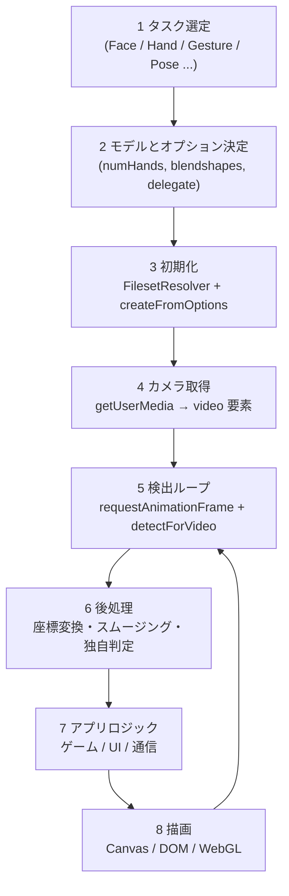
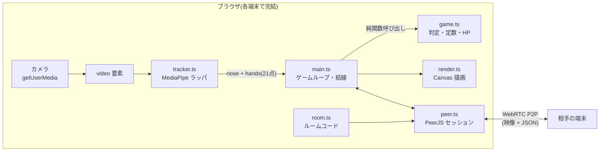
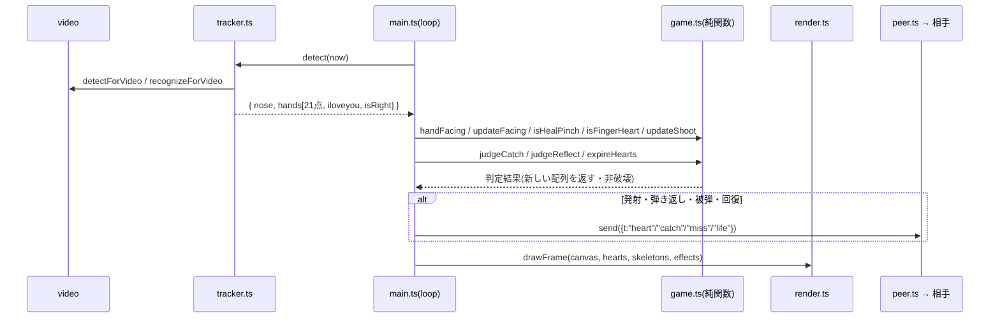
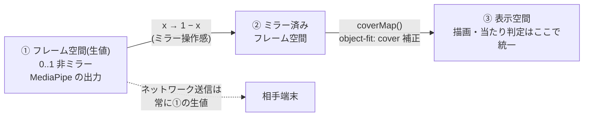
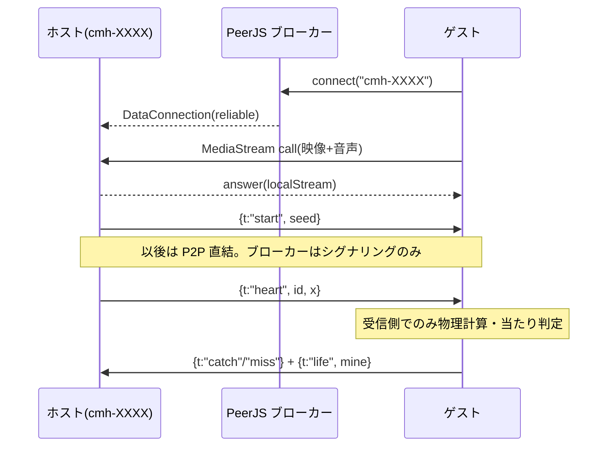

# MediaPipe 開発ガイド — 一般的な開発フローと本プロジェクトの実装

[README.md(基礎ガイド)](./README.md) が「MediaPipe とは何か・最小の使い方」を扱うのに対し、
このドキュメントは「**一般的な MediaPipe アプリはどう作るか**」と「**Catch My Heart はそれをどう実装したか**」を対比して解説する。

## 1. 一般的な MediaPipe アプリの開発フロー

どの MediaPipe アプリ(Web)もおおよそ次の工程をたどる。

| 工程           | 一般的な選択肢                        | 本プロジェクトの選択                                   |
| -------------- | ------------------------------------- | ------------------------------------------------------ |
| タスク選定     | 必要な部位のタスクを組み合わせる      | FaceLandmarker(鼻先のみ)+ GestureRecognizer(21点+分類) |
| モデル設定     | 精度と速度のトレードオフを調整        | `numHands: 1`(片手プレイ前提)、blendshapes 無効        |
| 初期化         | CDN or セルフホストで WASM/モデル配信 | CDN(jsDelivr + Google Storage)。`tracker.ts` に集約    |
| カメラ         | `getUserMedia`                        | 前面カメラ固定(`facingMode: "user"`)                   |
| 検出ループ     | rAF ごと or 間引き                    | rAF ごとに Face + Gesture を両方実行                   |
| 後処理         | ピクセル座標化・スムージング          | 正規化座標のまま扱う。ミラー変換 + `coverMap` 補正     |
| アプリロジック | フレームワーク自由                    | vanilla TS。純関数(`game.ts`)に分離して TDD            |
| 描画           | Canvas 2D が最も手軽                  | Canvas 2D(ハート・骨格・エフェクト)                    |

## 2. 本プロジェクトのモジュール構成と責務

| モジュール   | 責務                                                                      | DOM依存       | テスト                            |
| ------------ | ------------------------------------------------------------------------- | ------------- | --------------------------------- |
| `tracker.ts` | MediaPipe の初期化(GPU→CPUフォールバック)と検出。生の正規化座標を返すだけ | video要素のみ | なし(薄いラッパ)                  |
| `game.ts`    | 判定・定数・HPモデル。**全て純関数**                                      | なし          | `game.test.ts`                    |
| `room.ts`    | ルームコード生成/検証/PeerID 規約                                         | なし          | `room.test.ts`                    |
| `render.ts`  | Canvas 描画(ハート・骨格・エフェクト)                                     | canvas要素    | `render.test.ts`(純関数部)        |
| `peer.ts`    | PeerJS 接続・`Msg` 型・送受信                                             | なし          | なし(手動E2E)                     |
| `main.ts`    | 画面遷移・ゲームループ・入力の結線                                        | 全面的        | なし(ロジックはgame.tsへ追い出す) |

設計方針: **MediaPipe(tracker)と判定ロジック(game)を分離する**。検出結果を受けてどう判定するかはすべて `game.ts` の純関数にあるため、カメラなしで TDD できる。

## 3. 1フレームの処理シーケンス

検出からネットワーク送信までが 1 フレーム(rAF)の中でどう流れるか。

## 4. 座標系の変換パイプライン

MediaPipe 開発で最もバグりやすいのが座標系。本プロジェクトは 3 つの空間を明確に分けている。

| 空間         | 使う場面                    | 理由                                                                 |
| ------------ | --------------------------- | -------------------------------------------------------------------- |
| ① 生値       | ネットワーク送信(`heart.x`) | 端末ごとの表示条件に依存しない共通言語にする                         |
| ② ミラー済み | (中間表現)                  | 自撮りの「右に動かすと右に映る」操作感                               |
| ③ 表示空間   | 描画と当たり判定の両方      | 判定と描画を同じ空間で行えば「見た目と判定のズレ」が構造的に起きない |

一般的な開発では「②を飛ばしてピクセル座標に直接変換する」ことが多いが、
映像を `object-fit: cover` で表示する場合はトリミング分のオフセット補正(`coverMap`)を挟まないと骨格が手からズレる。

## 5. 一般的なハマりどころと本実装の対策

| ハマりどころ(一般論)    | 典型的な症状               | 本実装の対策                                    |
| ----------------------- | -------------------------- | ----------------------------------------------- |
| タイムスタンプの重複    | エラー・空の検出結果       | `tracker.ts` が単調増加を保証(`lastTs + 1`)     |
| GPU delegate 非対応端末 | 初期化で throw             | GPU 失敗時に CPU で作り直すフォールバック       |
| ミラーの取り違え        | 手と描画が左右逆           | 変換を `toStage()` 1箇所に集約                  |
| 検出ロスト時の誤発火    | 手を見失った瞬間に誤発射   | `hand` が存在するフレームでしか発射判定しない   |
| 判定ロジックがUIと癒着  | テスト不能・リグレッション | 判定を `game.ts` の純関数に分離し vitest で TDD |
| 初回ロードの長さ        | 白画面に見える             | ローディング表示 + 文言で待たせる               |

## 6. マルチプレイヤー化の設計(MediaPipe × P2P)

MediaPipe 自体はシングル端末の技術。対戦にするには「何を送るか」の設計が要る。

ポイント(一般論としても有効な設計):

- **ランドマーク座標をそのまま送らない**。送るのは「発射した」「キャッチした」などの**意味のあるイベント + 最小限の座標**だけ。帯域も同期バグも減る
- **判定は受信側でのみ行う**(自分に飛んでくるハートは自分の端末が判定)。二重判定による不整合を構造的に排除
- **HP は single writer**(自分のHPは自分だけが書き、`life` で通知)。競合状態を作らない
- 乱数が絡む要素(お題)は **seed を共有して両端末で決定的に計算**する

## 7. 本プロジェクト固有のジェスチャー設計

GestureRecognizer の定型分類だけに頼らず、**幾何判定と組み合わせる**のが実戦的。

| 入力                    | 実装方式                                              | なぜ分類だけに頼らないか                                       |
| ----------------------- | ----------------------------------------------------- | -------------------------------------------------------------- |
| 🫰 指ハート(発射)       | 幾何: ピンチ + **手の甲向き**(`isFingerHeart`)        | 「ピンチ」は定型分類に存在せず、向きも分類だけでは安定しない   |
| 👌 つまみキャッチ(回復) | 幾何: ピンチ + **手のひら向き**(`isHealPinch`)        | 同じピンチでも**手の向き**で発射と回復を分ける(顔の近さは廃止) |
| 🫴 お皿の手(キャッチ)   | 幾何: `isOpenHand`(指先が手首からMCPの1.3倍以遠 ×3本) | `Open_Palm` 分類は手のひらがカメラ正対でないと外れやすい       |
| 🤟 弾き返し             | 分類 + 幾何フォールバック(`isILoveYou`)               | 分類トップ1が None に転ぶと反応しないため幾何判定を併用        |

**手の向き判定** `handFacing`: 手首0→人差し指MCP5 と 手首0→小指MCP17 の 2D 外積の符号 + handedness(左右で符号が反転)。単発ノイズ対策に `updateFacing` で連続数フレーム一致まで確定を遅らせる。発射は `updateShoot` で「指を開いた瞬間」に確定し、ピンチ維持のまま手のひらへ持ち替えたらキャンセル(誤爆防止)。

排他制御は `game.ts` に集約(ピンチ中はキャッチ不可、🤟中はクールダウン中でもキャッチ不可 = 強力な技のリスク。`canOpenCatch`)。

## 参考

- 基礎知識と最小コード: [README.md](./README.md)
- 本プロジェクトの技術仕様の単一情報源: [../architecture/technical-reference.md](../architecture/technical-reference.md)
