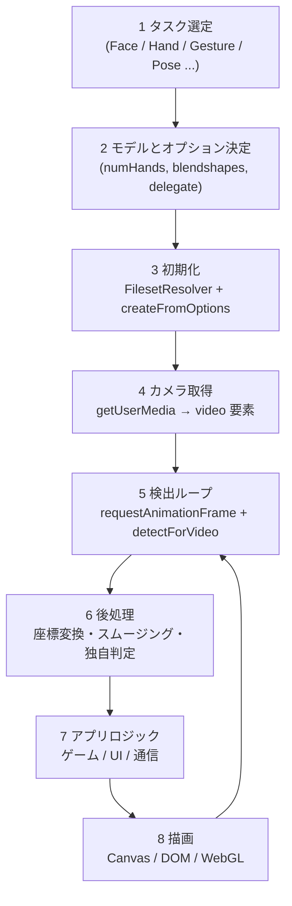
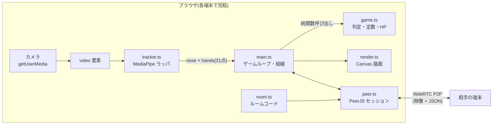
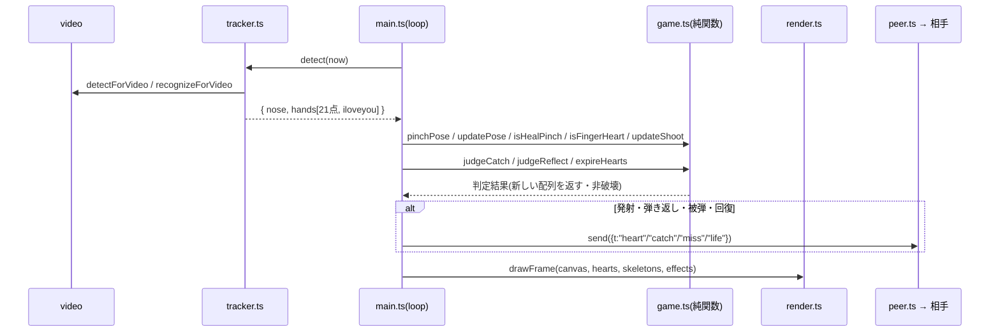
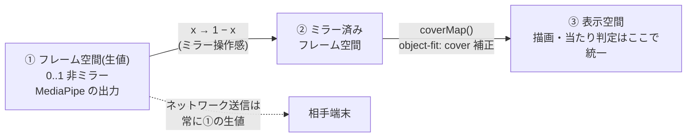
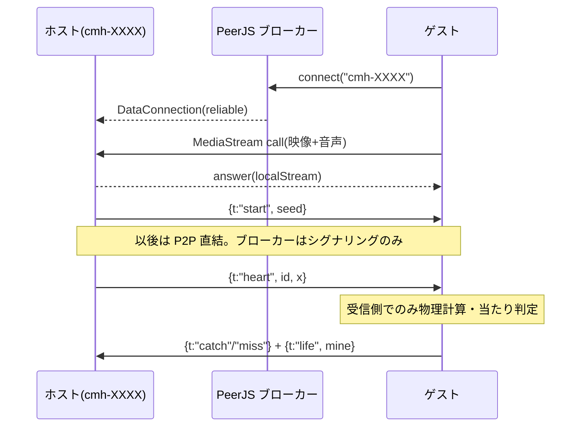
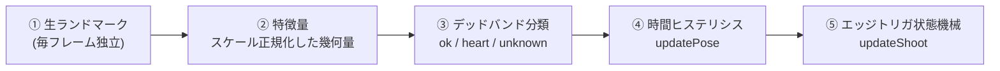

# MediaPipe 開発ガイド — 一般的な開発フローと本プロジェクトの実装

[README.md(基礎ガイド)](./README.md) が「MediaPipe とは何か・最小の使い方」を扱うのに対し、
このドキュメントは「**一般的な MediaPipe アプリはどう作るか**」と「**Catch My Heart はそれをどう実装したか**」を対比して解説する。

## 1. 一般的な MediaPipe アプリの開発フロー

どの MediaPipe アプリ(Web)もおおよそ次の工程をたどる。



| 工程           | 一般的な選択肢                        | 本プロジェクトの選択                                   |
| -------------- | ------------------------------------- | ------------------------------------------------------ |
| タスク選定     | 必要な部位のタスクを組み合わせる      | FaceLandmarker(鼻先のみ)+ GestureRecognizer(21点+分類) |
| モデル設定     | 精度と速度のトレードオフを調整        | `numHands: 1`(片手プレイ前提)、blendshapes 無効        |
| 初期化         | CDN or セルフホストで WASM/モデル配信 | CDN(jsDelivr + Google Storage)。`tracker.ts` に集約    |
| カメラ         | `getUserMedia`                        | 前面カメラ固定(`facingMode: "user"`)                   |
| 検出ループ     | rAF ごと or 間引き                    | rAF ごとに Face + Gesture を両方実行                   |
| 後処理         | ピクセル座標化・スムージング          | 正規化座標のまま扱う。ミラー変換 + `coverMap` 補正     |
| アプリロジック | フレームワーク自由                    | vanilla TS。純関数(`game.ts`)に分離して TDD            |
| 描画           | Canvas 2D が最も手軽                  | Canvas 2D(ハート・骨格・エフェクト)                    |

## 2. 本プロジェクトのモジュール構成と責務



| モジュール   | 責務                                                                      | DOM依存       | テスト                            |
| ------------ | ------------------------------------------------------------------------- | ------------- | --------------------------------- |
| `tracker.ts` | MediaPipe の初期化(GPU→CPUフォールバック)と検出。生の正規化座標を返すだけ | video要素のみ | なし(薄いラッパ)                  |
| `game.ts`    | 判定・定数・HPモデル。**全て純関数**                                      | なし          | `game.test.ts`                    |
| `room.ts`    | ルームコード生成/検証/PeerID 規約                                         | なし          | `room.test.ts`                    |
| `render.ts`  | Canvas 描画(ハート・骨格・エフェクト)                                     | canvas要素    | `render.test.ts`(純関数部)        |
| `peer.ts`    | PeerJS 接続・`Msg` 型・送受信                                             | なし          | なし(手動E2E)                     |
| `main.ts`    | 画面遷移・ゲームループ・入力の結線                                        | 全面的        | なし(ロジックはgame.tsへ追い出す) |

設計方針: **MediaPipe(tracker)と判定ロジック(game)を分離する**。検出結果を受けてどう判定するかはすべて `game.ts` の純関数にあるため、カメラなしで TDD できる。

## 3. 1フレームの処理シーケンス

検出からネットワーク送信までが 1 フレーム(rAF)の中でどう流れるか。



## 4. 座標系の変換パイプライン

MediaPipe 開発で最もバグりやすいのが座標系。本プロジェクトは 3 つの空間を明確に分けている。



| 空間         | 使う場面                    | 理由                                                                 |
| ------------ | --------------------------- | -------------------------------------------------------------------- |
| ① 生値       | ネットワーク送信(`heart.x`) | 端末ごとの表示条件に依存しない共通言語にする                         |
| ② ミラー済み | (中間表現)                  | 自撮りの「右に動かすと右に映る」操作感                               |
| ③ 表示空間   | 描画と当たり判定の両方      | 判定と描画を同じ空間で行えば「見た目と判定のズレ」が構造的に起きない |

一般的な開発では「②を飛ばしてピクセル座標に直接変換する」ことが多いが、
映像を `object-fit: cover` で表示する場合はトリミング分のオフセット補正(`coverMap`)を挟まないと骨格が手からズレる。

## 5. 一般的なハマりどころと本実装の対策

| ハマりどころ(一般論)    | 典型的な症状               | 本実装の対策                                    |
| ----------------------- | -------------------------- | ----------------------------------------------- |
| タイムスタンプの重複    | エラー・空の検出結果       | `tracker.ts` が単調増加を保証(`lastTs + 1`)     |
| GPU delegate 非対応端末 | 初期化で throw             | GPU 失敗時に CPU で作り直すフォールバック       |
| ミラーの取り違え        | 手と描画が左右逆           | 変換を `toStage()` 1箇所に集約                  |
| 検出ロスト時の誤発火    | 手を見失った瞬間に誤発射   | `hand` が存在するフレームでしか発射判定しない   |
| 判定ロジックがUIと癒着  | テスト不能・リグレッション | 判定を `game.ts` の純関数に分離し vitest で TDD |
| 初回ロードの長さ        | 白画面に見える             | ローディング表示 + 文言で待たせる               |

## 6. マルチプレイヤー化の設計(MediaPipe × P2P)

MediaPipe 自体はシングル端末の技術。対戦にするには「何を送るか」の設計が要る。



ポイント(一般論としても有効な設計):

- **ランドマーク座標をそのまま送らない**。送るのは「発射した」「キャッチした」などの**意味のあるイベント + 最小限の座標**だけ。帯域も同期バグも減る
- **判定は受信側でのみ行う**(自分に飛んでくるハートは自分の端末が判定)。二重判定による不整合を構造的に排除
- **HP は single writer**(自分のHPは自分だけが書き、`life` で通知)。競合状態を作らない
- 乱数が絡む要素(お題)は **seed を共有して両端末で決定的に計算**する

## 7. 本プロジェクト固有のジェスチャー設計

GestureRecognizer の定型分類だけに頼らず、**幾何判定と組み合わせる**のが実戦的。

| 入力                  | 実装方式                                                                   | なぜ分類だけに頼らないか                                                     |
| --------------------- | -------------------------------------------------------------------------- | ---------------------------------------------------------------------------- |
| 🫰 指ハート(発射)     | 幾何: ピンチ + **中指/薬指/小指を折り畳む**(`isFingerHeart`, pose="heart") | 「ピンチ」は定型分類に無い。指ハートは向きが定まらず、指の伸び具合が最も安定 |
| 👌 つまみ(回復)       | 幾何: ピンチ + **中指/薬指/小指が3本伸びる**(`isHealPinch`, pose="ok")     | 同じピンチでも**指の伸び本数**で発射と回復を分ける(向き・顔の近さは廃止)     |
| 🫴 お皿の手(キャッチ) | 幾何: `isOpenHand`(指先が手首からMCPの1.3倍以遠 ×3本)                      | `Open_Palm` 分類は手のひらがカメラ正対でないと外れやすい                     |
| 🤟 弾き返し           | 分類 + 幾何フォールバック(`isILoveYou`)                                    | 分類トップ1が None に転ぶと反応しないため幾何判定を併用                      |

**姿勢分類** `pinchPose`: 中指・薬指・小指の伸び本数で 👌(3本=ok)/🫰(折り畳み=heart)を分ける。手の向き(palm/back)は指ハートのエッジ姿勢で外積が潰れて不安定だったため、回転に強い指伸び判定へ切替(実機骨格スクショで確定)。`updatePose` で連続数フレーム一致まで確定を遅らせ、`updateShoot` で「指を開いた瞬間」に発射・👌へ持ち替えたらキャンセル。`?debug=1` で ext/pose/pinch/spread/gesture を実測表示して閾値を調整できる。

排他制御は `game.ts` に集約(ピンチ中はキャッチ不可、🤟中はクールダウン中でもキャッチ不可 = 強力な技のリスク。`canOpenCatch`)。

## 8. ジェスチャー検出を「信号処理」として設計する

MediaPipe が返すのは**毎フレーム独立の生の点群**。そのまま「距離がしきい値以下ならピンチ」と単発判定すると、手ブレ・一時的な検出ロスト・境界付近のちらつきで、認識がガタガタになる。本プロジェクトが 👌/🫰 の誤認識を潰す過程で行き着いた設計は、生の分類を**4段のパイプライン**に通すこと。



### 8.1 特徴量は「絶対距離」ではなく「比」にする

手はカメラに近づくほど大きく写る。だから「指先の絶対座標距離」でしきい値を切ると、距離によって判定が変わってしまう。**同じ手の中の別の距離で割って正規化**すれば、カメラからの距離・手の大きさに依存しない無次元量になる。

指の伸び判定(`extendedMRP`)がまさにこれ:

```ts
// 指先(tip)が付け根(mcp)より「手首から見て遠い」= 伸びている
const dist = (i) => Math.hypot(landmarks[i].x - wrist.x, landmarks[i].y - wrist.y);
extended = dist(tip) > dist(mcp) * OPEN_HAND_RATIO; // 1.3
```

`dist(tip)/dist(mcp)` という比で見ているので、手が大きく写っても小さく写っても同じしきい値(1.3)で効く。中指・薬指・小指の3本でこれを数え、`pinchPose` が本数で 👌(3本)/🫰(0〜1本)を分ける。

### 8.2 なぜ「手の向き」判定は失敗したか(没アプローチの記録)

当初は「👌=手のひら / 🫰=手の甲」と考え、手のひらの法線向きを **手首0→人差し指MCP5** と **手首0→小指MCP17** の 2D 外積の符号で求めようとした:

```
cross = (P5 - P0) × (P17 - P0)   // 符号で手のひら/手の甲
```

これは**手のひらがカメラに正対しているうち**は効く。しかし実機スクショで判明したのは、指ハートは手を**斜め・小指側のエッジ**に向ける姿勢だということ。このとき P0・P5・P17 がほぼ一直線に並び、外積が 0 付近へ潰れる → 符号が定まらず、わずかなノイズで palm↔back が反転 →「反応しない/急に誤発射」。

**教訓**: 検出量は「その姿勢で退化しないか(値がゼロや不定に潰れないか)」を必ず確認する。指の伸び具合は手を回しても退化しないので、こちらが正解だった。3D の z 座標や `worldLandmarks` で法線を出す手もあるが、単眼カメラの奥行き推定はノイズが大きく、今回は使わなかった。

### 8.3 デッドバンド + 時間ヒステリシス

生の特徴量には必ず境界付近のちらつきがある。2段構えで吸収する:

- **デッドバンド(空間)**: `pinchPose` は 3本以上=ok、1本以下=heart、**間の2本は `unknown`**。ok と heart の境界に緩衝地帯を置き、1本の伸び縮みで役割が反転しないようにする。
- **ヒステリシス(時間)**: `updatePose` は同じ姿勢が**連続 `POSE_STABLE_FRAMES`(4)フレーム**続いて初めて確定を切り替える。`unknown` サンプルは無視して直前状態を保持するので、1フレームの検出ロストで状態が飛ばない。

```ts
// 連続一致でのみ確定。unknown は直前を保持(=状態を飛ばさない)
export function updatePose(state, sample) {
  if (sample === "unknown") return state;
  if (sample === state.current) return { ...state, candidate: sample, count: 0 };
  const count = sample === state.candidate ? state.count + 1 : 1;
  if (count >= POSE_STABLE_FRAMES) return { current: sample, candidate: sample, count: 0 };
  return { ...state, candidate: sample, count };
}
```

デッドバンドとヒステリシスはトレードオフ:強くすると誤認識は減るが反応が鈍る。だから**しきい値は現物合わせ**になる(→ 8.5)。

### 8.4 「状態」ではなく「変化の瞬間」で撃つ(エッジトリガ)

発射は「🫰 の間ずっと」ではなく「🫰 をやめて**指を開いた瞬間**」に一度だけ起こしたい。これはレベル(状態)ではなくエッジ(遷移)で駆動する古典的な状態機械。`updateShoot` は蓄積開始・発射・キャンセルを純粋な遷移として持つ:

| 現在   | 入力                         | 遷移                                 |
| ------ | ---------------------------- | ------------------------------------ |
| 蓄積中 | 手を見失う                   | キャンセル(発射しない)               |
| 蓄積中 | ピンチを解く(`!pinched`)     | **発射**(長押し時間をチャージ判定へ) |
| 蓄積中 | 👌 へ持ち替え(`pose==="ok"`) | キャンセル(誤爆防止)                 |
| なし   | 🫰(fingerHeart)              | 蓄積開始(長押し時間を記録)           |

「👌 へ持ち替えたらキャンセル」が入っているのは、🫰 のまま手首を返して回復しようとしたときに、指を開いていないのに発射扱いになる誤爆を防ぐため。**チャージの長押し時間だけは状態(蓄積開始時刻)として保持**し、発射の確定はエッジで行う、という状態/エッジの使い分けがポイント。

### 8.5 カメラ無しで作る/直す — 純関数 + TDD + デバッグHUD

知覚系は「実機で動かさないと分からない」と思われがちだが、本プロジェクトは**判定ロジックを全部 `game.ts` の純関数**に追い出しているので、合成した landmark 配列を入れて `pinchPose`/`updatePose`/`updateShoot` を vitest で回帰テストできる(カメラ不要)。ロジックのバグはここで潰す。

一方で**しきい値(1.3 / 3本 / 1本 / 4フレーム)は現物合わせ**でしか決められない。そこで `?debug=1` で起動すると、画面左上に毎フレームの内部値を出すデバッグHUDが出る:

```
ext=3 | ok | pinch=1 | spread=0.72 | heal
```

👌 のとき `ext` が 3 に届くか、🫰 で 0〜1 に落ちるかを**実測しながら**しきい値を詰める。「知覚の中身を可視化してから調整する」——当てずっぽうのチューニングを避ける常道。純関数(カメラ不要のロジック検証)とHUD(実機での数値合わせ)の役割分担が、知覚系を安定させる近道だった。

## 参考

- 基礎知識と最小コード: [README.md](./README.md)
- 本プロジェクトの技術仕様の単一情報源: [../architecture/technical-reference.md](../architecture/technical-reference.md)
